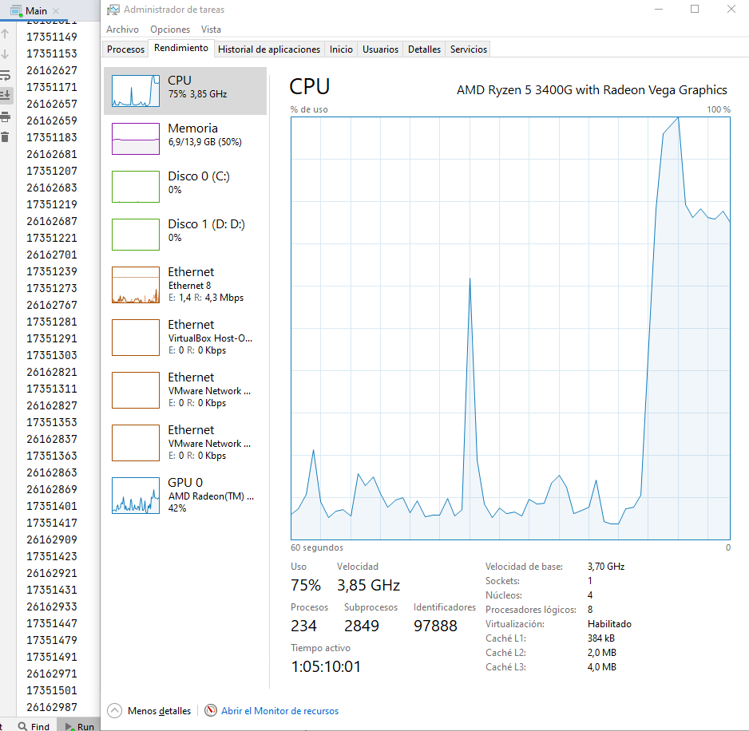
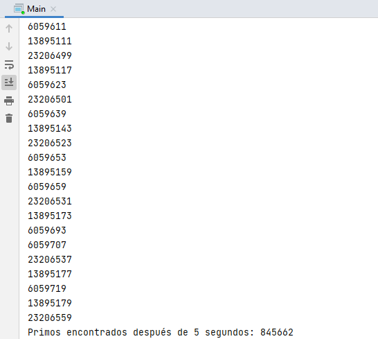
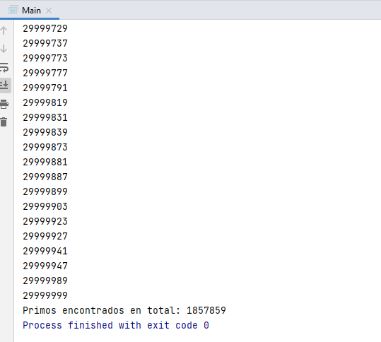
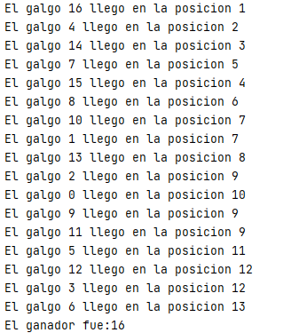
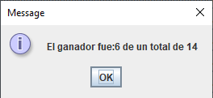
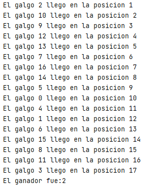

### Escuela Colombiana de Ingeniería

### Arquitecturas de Software – ARSW
## Laboratorio Programación concurrente, condiciones de carrera, esquemas de sincronización, colecciones sincronizadas y concurrentes - Caso Dogs Race

### Descripción:
Este ejercicio tiene como fin que el estudiante conozca y aplique conceptos propios de la programación concurrente.

### Parte I 
Antes de terminar la clase.

Creación, puesta en marcha y coordinación de hilos.

1. Revise el programa “primos concurrentes” (en la carpeta parte1), dispuesto en el paquete edu.eci.arsw.primefinder. Este es un programa que calcula los números primos entre dos intervalos, distribuyendo la búsqueda de los mismos entre hilos independientes. Por ahora, tiene un único hilo de ejecución que busca los primos entre 0 y 30.000.000. Ejecútelo, abra el administrador de procesos del sistema operativo, y verifique cuantos núcleos son usados por el mismo.


2. Modifique el programa para que, en lugar de resolver el problema con un solo hilo, lo haga con tres, donde cada uno de éstos hará la tarcera parte del problema original. Verifique nuevamente el funcionamiento, y nuevamente revise el uso de los núcleos del equipo.
```java
public static void main(String[] args) {
	int n=3;
	int average = 30000000/n;
	int cont = 0;
	for (int i = 0; i < n; i++){
		threads.add(new PrimeFinderThread(cont,cont+average, count));
		cont = cont + average;
	}
	for (PrimeFinderThread hilo: threads){
		hilo.start();
	}
}
```



3. Lo que se le ha pedido es: debe modificar la aplicación de manera que cuando hayan transcurrido 5 segundos desde que se inició la ejecución, se detengan todos los hilos y se muestre el número de primos encontrados hasta el momento. Luego, se debe esperar a que el usuario presione ENTER para reanudar la ejecución de los mismo.
```java
public class Main {
	private static LinkedList<PrimeFinderThread> threads = new LinkedList<>();

	public static void pararHilos(LinkedList<PrimeFinderThread> hilos){
		for (PrimeFinderThread hilo: threads){
			hilo.suspenderhilo();
		}
	}

	public static void reanudarHilos(LinkedList<PrimeFinderThread> hilos){
		for (PrimeFinderThread hilo: threads){
			hilo.renaudarhilo();
		}
	}

	public static void main(String[] args) {
		Long inicio = System.currentTimeMillis();
		int n=3;
		int average = 30000000/n;
		int cont = 0;
		AtomicInteger count = new AtomicInteger();

		for (int i = 0; i < n; i++){
			threads.add(new PrimeFinderThread(cont,cont+average, count));
			cont = cont + average;
		}

		for (PrimeFinderThread hilo: threads){
			hilo.start();
		}

		while(true){
			if(System.currentTimeMillis()-inicio==5000){
				pararHilos(threads);
				System.out.print("Primos encontrados después de 5 segundos: "+count);
				break;
			}
		}

		Scanner waitForKeypress = new Scanner(System.in);
		waitForKeypress.nextLine();
		reanudarHilos(threads);

		for (PrimeFinderThread hilo: threads){
			try {
				hilo.join();
			} catch (InterruptedException interruptedException) {
				interruptedException.printStackTrace();
			}
		}
		System.out.print("Primos encontrados en total: "+count);
	}

}
 ```

 ```java
public class PrimeFinderThread extends Thread {
	private int a,b;
	private List<Integer> primes=new LinkedList<Integer>();
	private boolean suspender;
	private AtomicInteger count;

	public PrimeFinderThread(int a, int b, AtomicInteger count) {
		super();
		this.a = a;
		this.b = b;
		this.suspender = false;
		this.count = count;
	}

	public void run() {
		for (int i = a; i <= b; i++) {
			if (isPrime(i)) {
				primes.add(i);
				System.out.println(i);
				count.incrementAndGet();
			}
			synchronized (this) {
				while (suspender) {
					try {
						wait();
					} catch (InterruptedException e) {
						e.printStackTrace();
					}
				}
			}
		}
	}


	boolean isPrime(int n) {
		if (n%2==0) return false;
		for(int i=3;i*i<=n;i+=2) {
			if(n%i==0)
				return false;
		}
		return true;
	}

	public List<Integer> getPrimes() {
		return primes;
	}

	synchronized void suspenderhilo(){
		suspender=true;
	}

	synchronized void renaudarhilo(){
		suspender=false;
		notify();
	}
}
 ```


### Parte II 


Para este ejercicio se va a trabajar con un simulador de carreras de galgos (carpeta parte2), cuya representación gráfica corresponde a la siguiente figura:


En la simulación, todos los galgos tienen la misma velocidad (a nivel de programación), por lo que el galgo ganador será aquel que (por cuestiones del azar) haya sido más beneficiado por el *scheduling* del
procesador (es decir, al que más ciclos de CPU se le haya otorgado durante la carrera). El modelo de la aplicación es el siguiente:


Como se observa, los galgos son objetos ‘hilo’ (Thread), y el avance de los mismos es visualizado en la clase Canodromo, que es básicamente un formulario Swing. Todos los galgos (por defecto son 17 galgos corriendo en una pista de 100 metros) comparten el acceso a un objeto de tipo
RegistroLLegada. Cuando un galgo llega a la meta, accede al contador ubicado en dicho objeto (cuyo valor inicial es 1), y toma dicho valor como su posición de llegada, y luego lo incrementa en 1. El galgo que
logre tomar el ‘1’ será el ganador.

Al iniciar la aplicación, hay un primer error evidente: los resultados (total recorrido y número del galgo ganador) son mostrados antes de que finalice la carrera como tal. Sin embargo, es posible que una vez corregido esto, haya más inconsistencias causadas por la presencia de condiciones de carrera.

Parte III

1.  Corrija la aplicación para que el aviso de resultados se muestre
    sólo cuando la ejecución de todos los hilos ‘galgo’ haya finalizado.
    Para esto tenga en cuenta:

    a.  La acción de iniciar la carrera y mostrar los resultados se realiza a partir de la línea 38 de MainCanodromo.

    b.  Puede utilizarse el método join() de la clase Thread para sincronizar el hilo que inicia la carrera, con la finalización de los hilos de los galgos.
    
    Para solucionar este error se adicionó el siguiente fragmento de código a partir de la linea 38 en MainCanodromo:
    ```java
	for (int i = 0; i < can.getNumCarriles(); i++) {
	    //sincroniza los hilos
	    try {
		galgos[i].join();
	    } catch (InterruptedException interruptedException) {
		interruptedException.printStackTrace();
	    }
	}
    ```

2.  Una vez corregido el problema inicial, corra la aplicación varias
    veces, e identifique las inconsistencias en los resultados de las
    mismas viendo el ‘ranking’ mostrado en consola (algunas veces
    podrían salir resultados válidos, pero en otros se pueden presentar
    dichas inconsistencias). A partir de esto, identifique las regiones
    críticas () del programa.
    
    Al probar el programa varia veces, se identificaron las siguientes inconsinstencias:
    
    Podía ocurrir que dos o más galgos llegaran en la misma posición:
    
    
    
    También sucedía que no se contaban todos los galgos al mostrar el resultado de la carrera:
    
    
    
    Las regiones críticas que se identificaron son:
    - Cada galgo puede consultar al mismo tiempo que otro galgo a la posición alcanzada en la carrera.
    - Al momento de modificar la última posición alcanzada en la carrera, varios galgos lo pueden hacer a la vez.
	
3.  Utilice un mecanismo de sincronización para garantizar que a dichas
    regiones críticas sólo acceda un hilo a la vez. Verifique los
    resultados.
    
    Para corregir estas inconsistencias, se sincronizó el bloque de código donde se encuentran las dos regiones críticas identificadas anteriormente:
    ```java
	synchronized (regl) {
	    ubicacion = regl.getUltimaPosicionAlcanzada();
	    regl.setUltimaPosicionAlcanzada(ubicacion + 1);
	    System.out.println("El galgo " + this.getName() + " llego en la posicion " + ubicacion);
	}
    ```
    Podemos ver que las dos regiones críticas son sincronizadas, donde se consulta la última posición alcanzada y donde se modifica esta misma variable.
    
    Los resultados después de realizar esta corrección son los siguientes:
    
    
    
4.  Implemente las funcionalidades de pausa y continuar. Con estas,
    cuando se haga clic en ‘Stop’, todos los hilos de los galgos
    deberían dormirse, y cuando se haga clic en ‘Continue’ los mismos
    deberían despertarse y continuar con la carrera. Diseñe una solución que permita hacer esto utilizando los mecanismos de sincronización con las primitivas de los Locks provistos por el lenguaje (wait y notifyAll).
    
     ```java
	can.setStopAction(
	    new ActionListener() {
		@Override
		public void actionPerformed(ActionEvent e) {
		    System.out.println("Carrera pausada!");
		    for (int i=0;i< galgos.length;i++){
		        galgos[i].setMovimiento(false);
		    }
	    	    can.pauseDialog();
	        }
	    }
	);
    ```
    ```java
	can.setContinueAction(
            new ActionListener() {
                @Override
                public void actionPerformed(ActionEvent e) {
                    System.out.println("Carrera reanudada!");
                    for (int i=0;i< galgos.length;i++){
                        galgos[i].setMovimiento(true);
                    }
                    can.continueDialog();
                }
            }
        );
    ```
    

